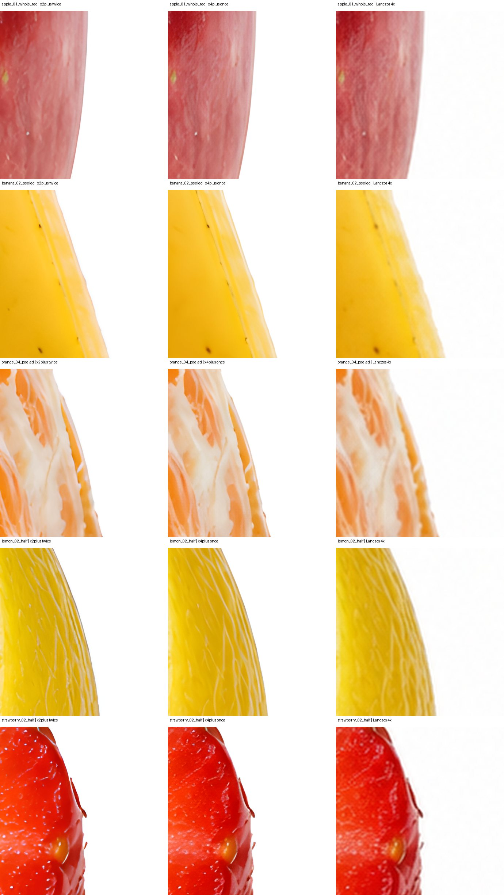

# Visual comparison gallery

These small JPEGs summarize **local experiments**. They make decisions easy to scan in Git; full-resolution images, masks and JSON metrics remain under each experiment's ignored raw-output folder. A thumbnail cannot clear anatomy, edges, branding or stock acceptance.

## Generation: four isolated objects

Left: SDXL Base 1.0. Right: FLUX.2 Klein 4B FP8. Klein met the basic single-object white-background brief in all four local cases; SDXL did not. [Cases, timings and limits](../../docs/generation-model-refresh-2026-09-26.md).

## Background removal: source and two cutouts

Left: source. Middle: BiRefNet DIS. Right: BEN2 Base. The checkerboard shows actual alpha. Opaque edges favored BiRefNet in this small test; glass remains manual review. [Seven-case review](../../docs/phase-5-results.md).

## Upscale: center and edge crops

Each row compares x2plus twice, x4plus once and Lanczos 4× on the same fruit. x4plus was the provisional 4× choice after native-size review. [Five-fruit review](../../docs/x4-upscale-evaluation-2026-09-26.md).

