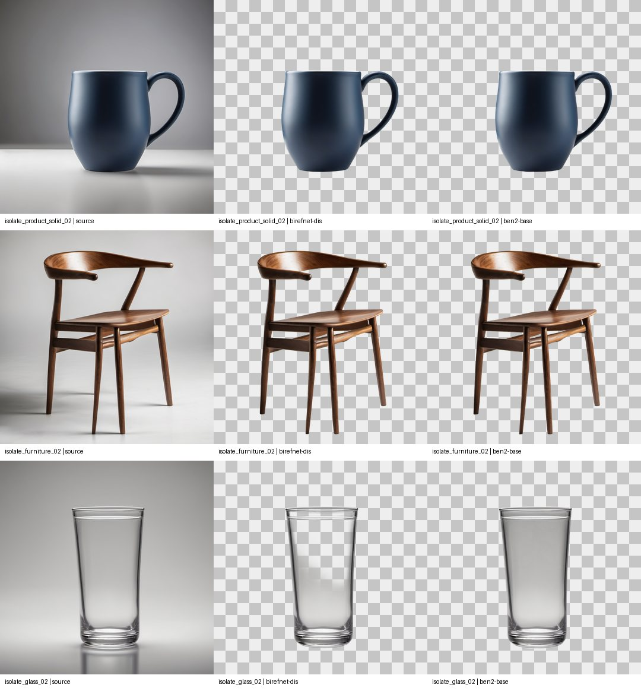

# BiRefNet standard DIS

- **ID:** `birefnet-dis`
- **Role:** Remove background
- **Current decision:** Default for opaque isolates

Cleaner opaque edges in seven-case local comparison; glass and sheer materials need manual review.

- Registry: [`data/background_registry.json`](../../../data/background_registry.json)
- License: `MIT`; commercial status: `allowed`; verified `2026-09-25`.
- License evidence: [https://github.com/ZhengPeng7/BiRefNet/blob/main/LICENSE](https://github.com/ZhengPeng7/BiRefNet/blob/main/LICENSE)
- Publisher/source: [https://huggingface.co/ZhengPeng7/BiRefNet/tree/6a62b7dcfa18a3829087877fb16c8006831e4220](https://huggingface.co/ZhengPeng7/BiRefNet/tree/6a62b7dcfa18a3829087877fb16c8006831e4220)
- Installed: `True`; registry VRAM estimate: `1.584` GB.
- Local checkpoint: `vendor/background_models/birefnet-dis/model.safetensors`
- SHA-256: `9ab37426bf4de0567af6b5d21b16151357149139362e6e8992021b8ce356a154`
- Reviewed result: [phase-5-results.md](../../../docs/phase-5-results.md)

The preview is for quick comparison; inspect native local files and the reviewed result before changing a default.
