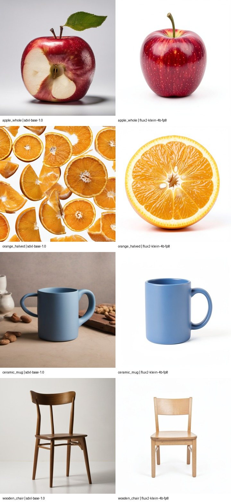

# Comfy-Org Qwen3 4B FP4 encoder for FLUX.2 Klein

- **ID:** `flux2-klein-qwen3-4b-fp4`
- **Role:** Klein text encoder
- **Current decision:** Required component

Installed and hash-verified with Klein; not a standalone image model.

- Registry: [`data/model_registry.json`](../../../data/model_registry.json)
- License: `Apache-2.0`; commercial status: `allowed`; verified `2026-09-26`.
- License evidence: [https://huggingface.co/Comfy-Org/vae-text-encorder-for-flux-klein-4b/tree/5f526678002e43af5551dadb73ce2e8c91b43afe](https://huggingface.co/Comfy-Org/vae-text-encorder-for-flux-klein-4b/tree/5f526678002e43af5551dadb73ce2e8c91b43afe)
- Publisher/source: [https://huggingface.co/Comfy-Org/vae-text-encorder-for-flux-klein-4b/tree/5f526678002e43af5551dadb73ce2e8c91b43afe/split_files/text_encoders](https://huggingface.co/Comfy-Org/vae-text-encorder-for-flux-klein-4b/tree/5f526678002e43af5551dadb73ce2e8c91b43afe/split_files/text_encoders)
- Installed: `True`; registry VRAM estimate: `not measured` GB.
- Local checkpoint: `vendor/ComfyUI/models/text_encoders/qwen_3_4b_fp4_flux2.safetensors`
- SHA-256: `3eab03a77adb0ee5304a4e677d5c10ac22f9049c1d7c894adca4f8bb39206ca8`
- Reviewed result: [generation-model-refresh-2026-09-26.md](../../../docs/generation-model-refresh-2026-09-26.md)

The preview is for quick comparison; inspect native local files and the reviewed result before changing a default.
