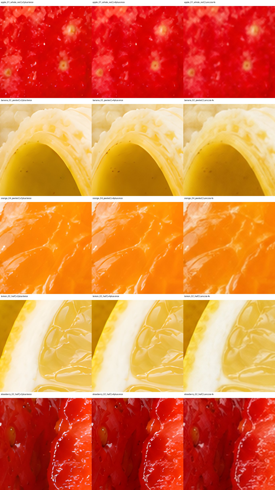

# RealESRGAN x4plus

- **ID:** `realesrgan-x4plus`
- **Role:** Pixel upscale
- **Current decision:** Default 4×, provisional

Five-fruit local comparison favored cleaner detail than two x2plus passes; stock review required.

- Registry: [`data/upscaler_registry.json`](../../../data/upscaler_registry.json)
- License: `BSD-3-Clause`; commercial status: `allowed`; verified `2026-09-26`.
- License evidence: [https://github.com/xinntao/Real-ESRGAN/blob/master/LICENSE](https://github.com/xinntao/Real-ESRGAN/blob/master/LICENSE)
- Publisher/source: [https://github.com/xinntao/Real-ESRGAN/releases/tag/v0.1.0](https://github.com/xinntao/Real-ESRGAN/releases/tag/v0.1.0)
- Installed: `True`; registry VRAM estimate: `not measured` GB.
- Local checkpoint: `vendor/ComfyUI/models/upscale_models/RealESRGAN_x4plus.pth`
- SHA-256: `4fa0d38905f75ac06eb49a7951b426670021be3018265fd191d2125df9d682f1`
- Reviewed result: [x4-upscale-evaluation-2026-09-26.md](../../../docs/x4-upscale-evaluation-2026-09-26.md)

The preview is for quick comparison; inspect native local files and the reviewed result before changing a default.
